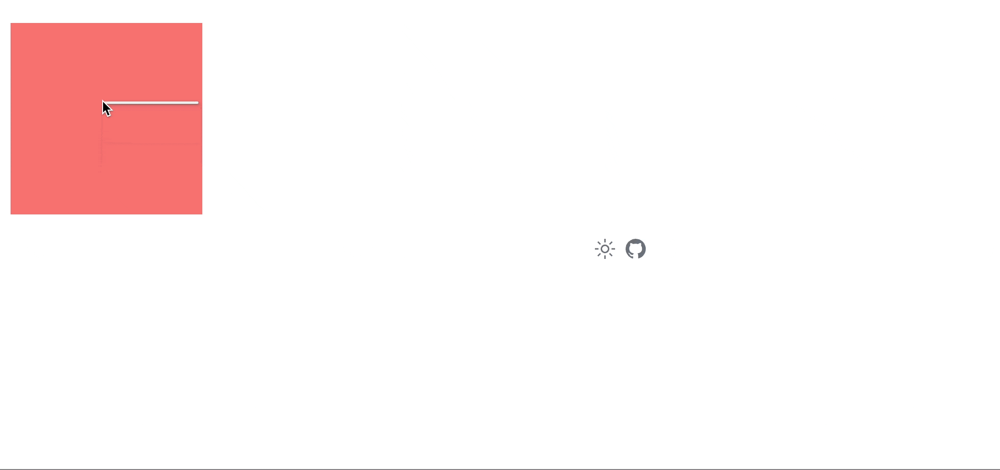

## vue3-right-click-menu
vue3右键菜单组件

## demo


## Install
```
npm i vue3-right-click-menu
```

## Usage
```
// 引入样式
import 'vue3-right-click-menu/index.css'
// 注册组件
import { RightClick } from 'vue3-right-click-menu'
app.component('vue-right-click', RightClick)
  <RightClick
    :menu="menu"
    @select="handleSelect"
  >
    // container 只对slot内容区域生效
    <main class="main" />
  </RightClick>
```

## Params
```ts
const menu = [
  { label: '新增', user: 'simon' },
  { label: '删除', user: 'simon' },
  { label: '编辑', user: 'simon' },
]
```

## Events
```
 -> select
 选择后触发select事件，接收menuItem
```

>样式不满足可重写覆盖

## License
[MIT](./LICENSE) License © 2022 [Simon He](https://github.com/Simon-He95)

<a href="https://github.com/Simon-He95/sponsor" target="_blank"></a>


<span><div align="center"></div></span>
